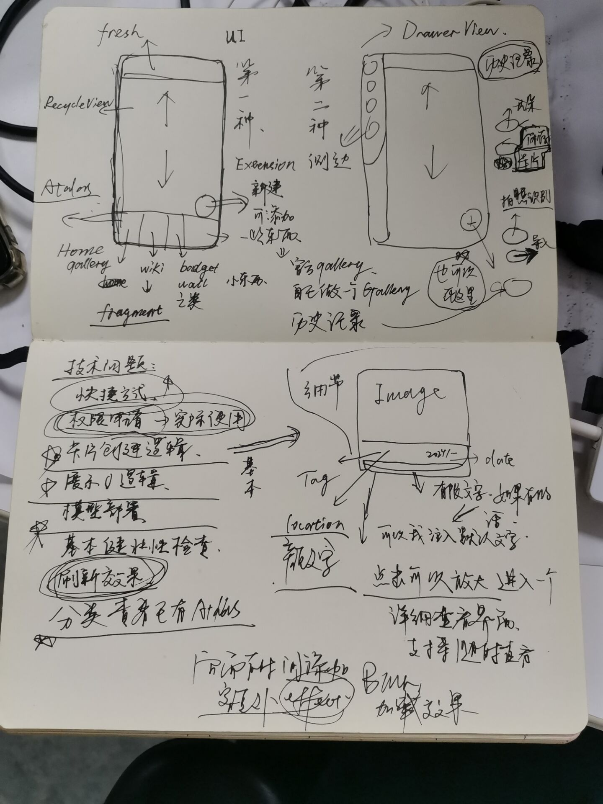

## 技术问题 QaA
* ### 设计
  * 本地模型或者接口上如何判断错误图片 如非云的图片识别问题 有没有可能解决 
* ### 代码
  * 好难 不会啊 :<  10/12/2024 学学kotlin  点名批评 twilight 还在偷懒 我看这人什么时候能发现
  * 屏幕旋转问题的解决 application 对象 以及 jetback
  * 快捷方式 创建 metadata 同时可能涉及调用接口的token问题
  * 历史记录 可能使用 SQlite
  * 图片的 读取 不知道是读取sd卡 还是内存 sd卡 使用bitmap 相关工具 
  * contentprovider 实现读取相册图片 貌似是 title="༼ つ ◕_◕ ༽つ Sorry I'm late. Take up anew

## Overview


### 10/30
```
任务与技术细节
基础 ：
  1. image卡片设计————要求              
    （1） 自定义细节 
          a. 分类tag 默认自定义导入 识别结果 可以自定义  或者按照自己的类别分类
          b. location 用户自己填入吧 不获取地理位置 时间，这个可以填入 也可以修改
          c.  用户自定义 文字 默认存在一些默认文字 （到时候 我来准备(SpikeIHG)）
          
    （2）显示逻辑
          a. 点击可以放大 放大的另一个格式
          b. 所有的图片都是一个card一样 形成一个类似图库的上下滑动 gallery
          c. 可以随时删除 del
    (3) 拓展功能
          a. 也许可以自定图册 如果识别图片很多的话 atlas
          b. 顺序也学可以自定义滑动
    (4) 初始显示
          a. 可以我来提供初始的图片信息就是8大类云朵的图片实例吧

```

*   ref: [添加删除逻辑](https://github.com/wasabeef/recyclerview-animators)
*   ref: [滑动布局](https://github.com/yqritc/RecyclerView-MultipleViewTypesAdapter)
*   ref: [布局](https://github.com/magiepooh/RecyclerItemDecoration)
*   ref : [这里有一个奇怪的布局](https://github.com/flavienlaurent/discrollview)
*   ref : [一个替代的tabbar](https://github.com/nirukk52/SnapTabLayout)
*   
*   其他资料 可以搜搜更多的 recycleview
### 11/4
```
  2. wiki设计
    （1）. 布局
          目前打算使用那个球显示 点击显示细节
    （2）. 逻辑
          打算可以支持自定义的一套分类逻辑
    （3）. 加入一些诗歌关于云的 
    （4）.  国际云图实时的api 有可能获得吗
```
* ref [一个fragment](https://github.com/magic-goop/tag-sphere)
### 10/30
```
  3. 创建按钮 button
  (1). 创建 然后分为拍照和导入
  (2). 具体就搜 button 控件看看 

```
*  ref : 权限申请 动态权限申请 视频有讲
*  ref :[基本的button](https://github.com/futuresimple/android-floating-action-button)
*  ref :[可以参考的button](https://github.com/oguzbilgener/CircularFloatingActionMenu)
### 11/4
```
  4. 快捷方式 ———— 视频里有 工作量一般 可写
```
### 11/10
```
  5 ，导航切换方式
    两种 就像图片里的 一种是最初计划 另外一种 是 as原生的navigation
```
* ref : [menu 效果](https://github.com/Yalantis/Side-Menu.Android)
```
  6. 其他效果 effect
  (1) blur 查看图片 blur
  (2) refresh效果
  (3) 一些可爱的小动画 maybe
  (4) 初始启动的页面，想要使用最近看的一部电影里面的一个截图的风格 
  7. 内置搜索功能 这个有点茫然 看时间和工作量把
```
* ref :[选择照片的一个framework](https://github.com/ChiliLabs/ChiliPhotoPicker)
```
 Badge wall 徽章墙 一些小东西 比如说集齐所有大种类的云 比如发现某些稀有云朵 属于一个小拓展
```